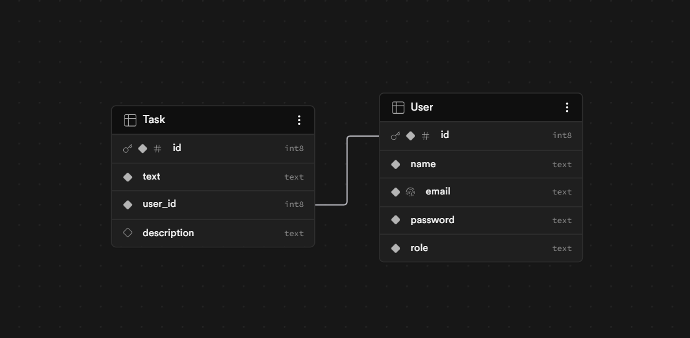

# Task Manager — Backend-Focused Fullstack Application

A scalable REST API with JWT authentication, role-based access control, and a Next.js frontend, built as part of a backend developer internship assignment.

---

## API Documentation

Swagger UI is available at:
```
https://task-manager-server-6lr9.onrender.com/api/v1/docs/
```

To test authenticated routes in Swagger:
1. Call `/api/v1/auth/login` or `/register`
2. Copy the `accessToken` from the response
3. Click **Authorize** in Swagger UI
4. Enter `<your_token>`
5. All protected routes are now accessible
6. For Admin access login in with email=admin@gmail.com and password=Admin@123
7. Afer logging in as an admin you can view all users including you, You can also add edit delete users. PLus you can cerate yoru own tasks

## Live URLs

| Service | URL |
|---|---|
| Backend API | https://task-manager-server-6lr9.onrender.com |
| API Docs (Swagger) | https://task-manager-server-6lr9.onrender.com/api/v1/docs |
| Frontend | https://task-manager-client-seven-chi.vercel.app |

---

## Tech Stack


### Backend
## Repo Link - https://github.com/deadpoolmanoj/task-manager-server.git
- **Runtime**: Node.js with TypeScript
- **Framework**: Express.js
- **Database**: PostgreSQL via Supabase
- **Authentication**: JWT (Access Token + Refresh Token)
- **Password Hashing**: bcryptjs
- **Validation**: Zod
- **Sanitization**: Custom sanitization utility
- **API Docs**: Swagger (swagger-jsdoc + swagger-ui-express)
- **Rate Limiting**: express-rate-limit
- **Cookie Handling**: cookie-parser
- **CORS**: cors

### Frontend
## repo link - https://github.com/deadpoolmanoj/task-manager-client.git
- **Framework**: Next.js 
- **Styling**: Tailwind CSS
- **Components**: shadcn/ui
- **State Management**: React Context (Auth)
- **Notifications**: Sonner (toast)

---

## Project Structure


```

## Getting Started

### Prerequisites
- Node.js 18+
- npm 
- Supabase account (or any PostgreSQL instance)

### Backend Setup

```bash
# Clone the repository
git clone https://github.com/deadpoolmanoj/task-manager-server.git
cd task-manager-server

# Install dependencies
npm install

# Create .env file
cp .env.example .env

```
Fill in your `.env`:

```env
PORT=3003
NODE_ENV=development
CLIENT_URL=http://localhost:3000

# Supabase
SUPABASE_URL=your_supabase_url
SUPABASE_ROLE_KEY=your_supabase_anon_key

# JWT
JWT_SECRET=your_long_random_secret
JWT_REFRESH_SECRET=your_different_long_random_secret
```

```bash
# Run in development
npm run dev

# Build and run in production
npm run build
npm start
```

### Frontend Setup

```bash
cd task-manager-client
npm install
npm run dev
```

Frontend runs on `http://localhost:3000` and proxies all `/api/v1/*` requests to the Express server via Next.js rewrites.

---

## Database Schema



### User Table
```sql
CREATE TABLE "User" (
    id        SERIAL PRIMARY KEY,
    name      VARCHAR(255) NOT NULL,
    email     VARCHAR(255) UNIQUE NOT NULL,
    password  VARCHAR(255) NOT NULL,         -- bcrypt hashed
    role      VARCHAR(10) DEFAULT 'user',    -- 'user' | 'admin'
);
```

### Task Table
```sql
CREATE TABLE "Task" (
    id           SERIAL PRIMARY KEY,
    text         VARCHAR(255) NOT NULL,
    description  TEXT,
    user_id      INTEGER REFERENCES "User"(id) ON DELETE CASCADE
);
```

---

## API Overview

All responses follow a consistent shape:

```json
// Success
{ "success": true, "message": "Success", "data": {} }

// Failure
{ "success": false, "message": "Error message" }
```

### Auth Routes — `/api/v1/auth`

| Method | Endpoint | Auth | Description |
|---|---|---|---|
| POST | `/register` | No | Register new user, returns accessToken + sets refresh cookie |
| POST | `/login` | No | Login, returns accessToken + sets refresh cookie |
| GET | `/me` | Cookie | Restore session from refresh token cookie |
| POST | `/logout` | No | Clear refresh token cookie |

### Task Routes — `/api/v1/tasks`

| Method | Endpoint | Auth | Description |
|---|---|---|---|
| GET | `/` | Bearer | Get all tasks for authenticated user |
| POST | `/` | Bearer | Create a new task |
| PUT | `/` | Bearer | Edit an existing task (ownership verified) |
| DELETE | `/:taskId` | Bearer | Delete a task (ownership verified) |

### User Routes — `/api/v1/users`

| Method | Endpoint | Auth | Description |
|---|---|---|---|
| GET | `/` | Bearer (Admin) | Get all users |
| POST | `/` | Bearer (Admin) | Create a new user |
| PUT | `/` | Bearer (Admin) | Edit an existing user |
| DELETE | `/:userId` | Bearer (Admin) | Delete a user |

Full interactive documentation available at `https://task-manager-server-6lr9.onrender.com/api/v1/docs/`.

---

## Authentication Flow

```
Register/Login
    ↓
accessToken (7d)  →  stored in memory (React context)
refreshToken (30d) →  stored in HttpOnly cookie (JS cannot access)
    ↓
Page Refresh
    ↓
GET /me reads cookie → issues new accessToken → back in memory
    ↓
Logout
    ↓
Cookie cleared + accessToken set to null in context
```

This approach avoids localStorage (XSS vulnerable) while maintaining a smooth UX — users stay logged in across page refreshes without re-entering credentials.

---

## Security Practices

| Practice | Implementation |
|---|---|
| Password hashing | bcryptjs with salt rounds |
| JWT access token | Short-lived (7d), in-memory only |
| JWT refresh token | Long-lived (30d), HttpOnly cookie — not accessible via JS |
| Input sanitization | Custom sanitize utility on all user-supplied strings |
| Input validation | Zod schemas on every route before hitting the controller |
| Rate limiting | 100 requests per 15 minutes per IP |
| Role-based access | Admin-only routes verified in service layer |
| Ownership checks | Task edit/delete verifies `user_id` matches token `id` |
| CORS | Restricted to known client origin with `credentials: true` |

---

## Scalability Notes

### Current Architecture
The application follows a **modular monolith** pattern — each feature (auth, tasks, users) is a self-contained module with its own controller, service, route, and validation. This makes it straightforward to extract into microservices later.

### Path to Scale

**Horizontal Scaling**
- The stateless JWT approach means any number of server instances can verify tokens without shared session state
- Deploy multiple Express instances behind a load balancer

**Caching**
- Add Redis to cache frequently read data (e.g. user role lookups on every admin route)
- Cache task lists per user with invalidation on write

**Microservices**
- Auth module → standalone Auth Service
- Tasks module → Task Service
- Users module → User Service
- Each communicates via REST or message queue 

**Database**
- Current: Supabase (managed PostgreSQL) — already production-ready
- Connection pooling via Supabase's built-in pooler
- Add read replicas for heavy read workloads

**Deployment**
- Backend: Render (current)
- Frontend: Vercel (recommended for Next.js)
- Database: Supabase 

---

